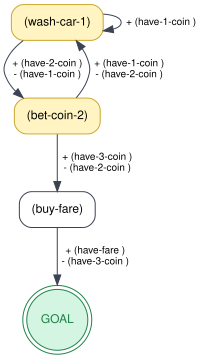

# Safe-Planner - A Single-Outcome Replanner for Computing Strong Cyclic Solutions in Fully Observable Non-Deterministic Domains

**Safe-Planner (SP)** is an off-line non-deterministic planning algorithm based on replanning that compiles a **Fully Observable Non-Deterministic (FOND)** planning problem into a set of classical planning problems which can be solved using a classical problem solver. SP then merges the obtained classical solutions and forms a non-deterministic solution policy to the original non-deterministic problem. SP avoids dead-end states by 
modifying a planning problem such that it prevents a classical planner to generate weak plans involving actions leading to dead-ends and therefore it generates safe policies. The execution of a safe policy is guaranteed to terminate in a goal state for all potential outcomes of the actions in the non-deterministic environment (if any exists).

SP can employ any off-the-shelf classical planner for problem solving. Planners are bundled via the [`pddl-solvers`](https://github.com/mokhtarivahid/pddl-solvers) submodule, which provides [FF] (and the conformant / contingent / metric / probabilistic variants), [Fast-Downward], [SymK], [ENHSP], [OPTIC], [POPF], [TFD], [LPG], [MADAGASCAR], [VHPOP], [PowerLifted] and [NextFLAP]. The submodule also bundles [VAL] for plan validation.

[VAL]: https://github.com/KCL-Planning/VAL

[FF]: https://fai.cs.uni-saarland.de/hoffmann/ff.html
[OPTIC]: https://nms.kcl.ac.uk/planning/software/optic.html
[MADAGASCAR]: https://users.aalto.fi/~rintanj1/jussi/satplan.html
[VHPOP]: http://www.tempastic.org/vhpop/
[LPG]: https://lpg.unibs.it/lpg/
[Fast-Downward]: http://www.fast-downward.org/
[PROBE]: https://github.com/aig-upf/probe
[SymK]: https://github.com/speckdavid/symk
[ENHSP]: https://github.com/hstairs/enhsp
[POPF]: https://github.com/fmrico/popf
[TFD]: https://github.com/neighthan/tfd
[PowerLifted]: https://github.com/abcorrea/powerlifted
[NextFLAP]: https://github.com/ossaver/NextFLAP


## Contents
1. [Installation](#installation)
2. [PPDDL](#ppddl)
3. [Usage](#usage)
4. [The planner output](#the-planner-output)
5. [How to cite](#how-to-cite)


## Installation

Safe-Planner targets **Python 3.8+** on Linux. The recommended workflow uses a
virtual environment and an editable install of the package:

```bash
# 1. clone the repository together with the planner submodule
git clone --recursive https://github.com/mokhtarivahid/safe-planner.git
cd safe-planner
# if you forgot --recursive:
#   git submodule update --init --recursive

# 2. (recommended) isolated Python environment
python3 -m venv .venv
source .venv/bin/activate

# 3a. install the project itself in editable mode — preferred
pip install -e .

# 3b. or, if you only want the runtime dependencies without installing the
#     package, use the plain requirements file
pip install -r requirements.txt
```

Both flows pull in [PLY] for PDDL parsing and PyYAML for the planner-profile
catalogue. The editable install additionally registers the `safe-planner`
console script. You can always invoke the planner without installing it via
the `./sp` wrapper, which sets `PYTHONPATH=src` automatically.

[PLY]: https://www.dabeaz.com/ply/

### System packages

A handful of OS-level tools are required to build the classical planners and
to render policy graphs:

```bash
sudo apt install -y \
    build-essential cmake bison flex \
    gawk g++ gcc make \
    graphviz                     # for `dot` (used by --render svg|pdf|png)
```

### Building the bundled planners

The optional extra planners live in the
[`pddl-solvers`](https://github.com/mokhtarivahid/pddl-solvers) submodule at
`third_party/pddl-solvers`. Compile one or all of them:

```bash
cd third_party/pddl-solvers
./build_all.sh                  # build every planner (and VAL)
./build_all.sh --planner symk   # build only one
./build_all.sh --planner ff fd madagascar   # build a subset
./build_all.sh --planner val    # build only VAL (needed for -V)
```

### Optional Python extras

For programmatic GraphViz access (most users won't need this — the CLI shells
out to the `dot` binary directly for `--render`):

```bash
sudo apt install -y graphviz-dev
pip install graphviz pygraphviz
```

For parsing the legacy multi-agent JSON output via Lua scripts (only used by
`-j` with multi-agent domains):

```bash
sudo apt install -y lua-penlight lua-json lua-ansicolors luarocks
sudo luarocks install graphviz
```


## PPDDL

Safe-Planner uses the **Probabilistic Planning Domain Definition Language (PPDDL)** as the domain modeling language with ``oneof`` clauses in actions' effects. PPDDL is an extension of the standard PDDL to support probabilistic or non-deterministic outcomes in the actions' descriptions. A description of PPDDL is available at http://reports-archive.adm.cs.cmu.edu/anon/2004/CMU-CS-04-167.pdf. 

A helpful collection of materials for AI Planning and PDDL are also provided at https://planning.wiki.

A useful introduction to learning PDDL is also available at https://fareskalaboud.github.io/LearnPDDL.

#### PDDL supported

Safe-Planner is strongly dependent on the employed external classical planners, so the given planning domains and problems are firstly required to be supported by the external classical planners.

Apart from the PDDL support of the external planners, Safe-Planner also supports limited but most useful features of the PDDL. Particularly, Safe-Planner supports the following PDDL requirements: `:strips`, `:typing`, `:equality`, `:negative-preconditions`, `:existential-preconditions`, `:universal-preconditions`, `:conditional-effects`, `:probabilistic-effects`.

More precisely, the following combinations are supported by Safe-Planner for modeling action effects:

##### conditional effects

```
(when (conditions) (effects))
```

```
(forall (variables list) (effects))
```

```
(forall (variables list) (when (conditions) (effects)))
```

##### non-deterministic effects

```
(oneof (effects)
       (when (conditions) (effects))
       (forall (variables list) (effects))
       (forall (variables list) (when (conditions) (effects)))
       ...)
```

```
(probabilistic P (effects)
               P (when (conditions) (effects))
               P (forall (variables list) (effects))
               P (forall (variables list) (when (conditions) (effects)))
               ...)
```


**Note:** currently, Safe-Planner does not support **untyped** objects, so when modeling a planning domain always use a type for objects.


## Usage


```bash
# using the 'sp' script
./sp <DOMAIN> <PROBLEM> [-c <PLANNERS_LIST>] [-r <MODE>] [-a] [-sp] \
     [-d] [--render svg|pdf|png] [-p] [-j] [-s] \
     [--profile PLANNER:NAME] [--list-profiles [PLANNER]] \
     [-V] [--val-timeout SECS] [--val-epsilon EPS] [--val-verbose] \
     [--direct] [--summary] [--no-color] [-v 0|1|2]
```

```bash
# for ease of use, one can pass only a problem file; a sibling 'domain.pddl' is auto-detected
./sp <PROBLEM> [...]
```
```bash
# in case of both domain and problem in one file
./sp <FILE> [...]
```

```bash
# using python3 module form (works from anywhere once installed with `pip install -e .`)
python3 -m safe_planner <DOMAIN> <PROBLEM> [...]
# or, equivalently, the installed console script:
safe-planner <DOMAIN> <PROBLEM> [...]
```


### Project layout

```
safe-planner/
├── sp                        # convenience wrapper -> `python3 -m safe_planner`
├── pyproject.toml            # src-layout packaging metadata
├── CHANGELOG.md              # release notes
├── requirements.txt          # plain pip dependency list (mirrors pyproject)
├── src/safe_planner/         # Python package
│   ├── cli.py                # command-line entry point (argparse)
│   ├── color.py              # TTY-aware ANSI colour helpers
│   ├── planner.py            # SP / NDP2 algorithm core
│   ├── compilation.py        # PPDDL -> classical compilation
│   ├── pddl/                 # PDDL/PPDDL parser (PLY) + AST
│   ├── io/                   # dot / json output formatters
│   │   ├── dot_plan.py       # GraphViz dot generator
│   │   ├── report.py         # versioned JSON report + run summary
│   │   └── json_plan.py      # legacy JSON output
│   └── planners/             # external-planner integration
│       ├── registry.py       # planner discovery (pddl-solvers)
│       ├── profiles.py       # YAML-backed planner argument profiles
│       ├── runner.py         # multiprocessing planner race + backend dispatch
│       ├── _run_planner_backend.py # default: shell out to pddl-solvers/run_planner.py (+ VAL)
│       ├── _direct_backend.py      # legacy in-process backend (--direct)
│       ├── validation.py     # in-process VAL wrapper used by --direct
│       └── adapters/extras.py# wrappers for the new pddl-solvers planners
├── third_party/pddl-solvers/ # git submodule with all integrated planners
├── benchmarks/               # FOND + classical benchmark suites
├── tests/                    # unit tests
├── scripts/                  # batch-run shell scripts (batch-run*.sh)
└── results/                  # generated stats and plots
```


### optional parameters

`-c <PLANNERS_LIST>`: a list of classical planners to race in parallel,
e.g. `-c ff`, `-c ff madagascar`, `-c ff fd madagascar`, ... (default `ff`).

`--profile PLANNER:NAME`: override the default argument profile for a
planner. Repeatable. Example: `--profile fd:optimal-lmcut`. Profiles
are loaded from
[`third_party/pddl-solvers/planner_profiles.yaml`](third_party/pddl-solvers/planner_profiles.yaml)
so every preset bundled with the submodule is selectable. Each planner's
default is whatever its YAML file lists first (e.g. Fast-Downward defaults
to the optimal `astar(lmcut())`).

`--list-profiles [PLANNER]`: print the profile catalogue and exit. With no
argument it dumps every planner; with a planner name it filters to just
that one. The currently-selected default is marked with `*`. Examples:

```bash
./sp --list-profiles            # all planners
./sp --list-profiles fd         # only Fast-Downward
./sp --list-profiles symk
```

`-r MODE`, `--ranking MODE`: choose how probabilistic/non-deterministic
outcomes and the resulting single-outcome classical domains are ordered.
Omitting this option is equivalent to `-r 0`.

| Mode | Strategy | Behavior |
|------|----------|----------|
| `0` | `source` | Preserve domain action, probabilistic/`oneof` block, and alternative order. This is the default. |
| `1` | `effect-count-asc` | Rank the smallest syntactic effects first. |
| `2` | `effect-count-desc` | Rank the largest syntactic effects first. |
| `3` | `probability-desc` | Rank complete outcomes and single-outcome domains by descending joint probability. |

An implicit residual no-op is appended after explicitly modeled alternatives
in source mode. `oneof` alternatives have no probability, so source order
breaks their ties under probability ranking.

All sorts are stable, so source order resolves ties. Ranking changes search
order and generated outcome suffixes (`action_0`, `action_1`, ...); it does not
remove modeled outcomes or weaken the safety requirement.

The Python API uses the descriptive strategy names:

```python
from safe_planner import Planner

policy = Planner(domain_file, problem_file, ranking="probability-desc")
```

For probabilistic blocks whose explicit probabilities sum to less than one,
Safe-Planner calculates the residual probability and represents it as an
implicit no-op outcome. Blocks whose probabilities exceed one are rejected.

`-a`: compile the non-deterministic domain into one classical domain using
the all-outcome compilation strategy only (skips single-outcome).

`-sp`: switch from the default sound NDP2 algorithm to the (unsound) SP
algorithm. Faster on some domains, but does not guarantee strong-cyclic
solutions.

`-p`: print the enumerated execution paths of the produced policy.

`-d`: emit a GraphViz dot file alongside the problem file.

`--render svg|pdf|png`: rasterise/vectorise the generated dot file via the
`dot` binary from GraphViz. Implies `-d`.

`-j`: also emit the legacy JSON plan format (experimental).

`-s`: store a structured run report at `<problem>.stat.json` with policy
states, outcomes, timings, planner configuration and an overall verdict.
Also appends a row to `results.csv` in the problem's directory.

`--summary`: print a colour-aware end-of-run summary (verdict + hints).
Automatically shown for non-solved runs.

`--no-color`: disable ANSI colour escapes regardless of TTY / env vars.
Colour can also be controlled via the `NO_COLOR` and `SP_COLOR=always|never|auto`
environment variables.

`-v 0|1|2`: verbosity. `0` minimal, `1` high-level, `2` external planners
output plus the full VAL plan-validation report (command, runtime, exit
code, VALID/INVALID verdict, VAL stdout/stderr).

#### Plan validation with VAL

`-V`, `--validate`: validate every internal classical plan with [VAL]. VAL
must be built first via `cd third_party/pddl-solvers && ./build_all.sh
--planner val`. With the default backend (`run_planner.py`) the validation
flags are forwarded so that each per-planner call produces its own VAL
report. With `--direct`, VAL is invoked in-process after each classical
call via `src/safe_planner/planners/validation.py`.

- `--val-timeout SECS`: per-invocation timeout (default `60`).
- `--val-epsilon EPS`: epsilon tolerance passed to VAL via `-t`
  (auto-set for temporal plans).
- `--val-verbose`: pass `-v` to VAL for verbose plan-check reporting.

At `-v 0/1` Safe-Planner prints only a one-line summary per call
(`VAL[ff]: valid`); at `-v 2` it prints the full detailed VAL report block.

#### Backend selection

`--direct`: call planner binaries directly (legacy path) instead of
routing through `pddl-solvers/run_planner.py` (the default). The direct
backend bypasses the YAML profile catalogue's runtime/timeout handling and
invokes VAL in-process after each classical call when `-V` is set.

#### Exit codes

The CLI returns an exit code that mirrors the policy verdict, useful in
shell pipelines / CI:

| Code | Verdict   | Meaning                                                |
|------|-----------|--------------------------------------------------------|
| 0    | solved    | strong-cyclic policy; every leaf is a goal             |
| 0    | trivial   | initial state already satisfies the goal               |
| 3    | partial   | weak / cyclic-but-not-strong policy                    |
| 4    | unsolved  | no plan at the initial state                           |


##### The following commands show some examples on how to run Safe-Planner on individual problems:

```bash
# Run Safe-Planner with FF (the default planner).
./sp benchmarks/fond-domains/elevators/p01.pddl

# Race FF + Madagascar using source order (the default).
./sp benchmarks/fond-domains/elevators/p01.pddl -c ff madagascar

# Rank likely determinizations first and produce full output.
./sp benchmarks/fond-domains/elevators/p01.pddl -c ff madagascar \
     -r 3 \
     -d --render pdf -s --summary

# Override the FD profile.
./sp benchmarks/fond-domains/blocksworld/p01.pddl -c fd --profile fd:satisficing-lmcut

# Validate every internal classical plan with VAL (requires VAL to be built).
./sp benchmarks/fond-domains/tireworld/p03.pddl -c ff -V

# Same, but show the full VAL diagnostic report per internal call.
./sp benchmarks/fond-domains/tireworld/p03.pddl -c ff -V -v 2

# Use the legacy in-process backend (skips pddl-solvers/run_planner.py).
./sp benchmarks/fond-domains/elevators/p01.pddl -c ff --direct
```


## The planner output

SP represent a policy as a sequence of numbered steps such that:

- Each step contains either a set of actions in one of the following formats:

    ```number : {actions} -- {} number/GOAL```

    ```number : {actions} -- {add_list} number/GOAL ...```

    ```number : {actions} -- {add_list} \ {del_list} number/GOAL ...```

- Each `number` represents the order/level of the execution of each step; 

- The set of actions `{actions}` at each step are followed by sets of conditions under which next steps are chosen (sets of conditions comes after one `--` for each outcome)  ; 

- Conditions are the different possible outcomes of actions in a step; 

- Empty conditions `{}` are true conditions and only appear for deterministic actions in a step; 

- Steps containing nondeterministic actions have more than one conditions and outcomes;

- Conditions include a set of `{add_list}` and a set of `{del_list}` (if any) of a nondeterministic step, that is, the effects added to a new state and the effects removed from the old state after the step is applied;

- The `number` after each condition represents the next step for the execution;

- The keyword `GOAL`  after a condition means the goal is achieved by that step.


##### Example 1: [`bus-fare`](benchmarks/prob_interesting/bus-fare.pddl) domain


```bash
./sp benchmarks/prob_interesting/bus-fare.pddl -j -d

@ PLAN
 0 : {(wash-car-1)} -- {(have-2-coin)} \ {(have-1-coin)} 1 -- {(have-1-coin)} 0
 1 : {(bet-coin-2)} -- {(have-1-coin)} \ {(have-2-coin)} 0 -- {(have-3-coin)} \ {(have-2-coin)} 2
 2 : {(buy-fare)} -- {} GOAL
```

the optional parameter `-d` translates the produced plan into a dot file in the same path:



Combine `-d` with `--render svg|pdf|png` to additionally rasterise the diagram
via the `dot` binary from GraphViz.

The optional parameter `-s` writes a structured run report next to the problem
file at `<problem>.stat.json`. The schema (`"schema": "1.0"`) is stable and
contains per-state actions/outcomes, timings, planner configuration, the
non-deterministic action set, and an overall verdict
(`solved` / `partial` / `trivial` / `unsolved`).

[**EXPERIMENTAL!**] the optional parameter `-j` translates the produced plan into a json file in the same path:

```json
{
    "plan": [
        "step_0", 
        "step_1", 
        "step_2"
    ],
    "step_0": {
        "actions": [
            {"name": "wash-car-1", "arguments": []}
        ],
        "outcomes": [
            {"next": "step_1", "condition": ["(have-2-coin)"]}, 
            {"next": "step_0", "condition": ["(have-1-coin)"]}
        ]
    },
    "step_1": {
        "actions": [{"name": "bet-coin-2", "arguments": []}
        ],
        "outcomes": [
            {"next": "step_0", "condition": ["(have-1-coin)"]},
            {"next": "step_2", "condition": ["(have-3-coin)"]}
        ]
    },
    "step_2": {
        "actions": [
            {"name": "buy-fare", "arguments": []}
        ],
        "outcomes": [
            {"next": "GOAL", "condition": ["(have-fare)"]}
        ]
    }
}
```


## How to cite

The following reference describes the algorithm of **Safe-Planner**.

```bibliography

@inproceedings{vahid:2021:icar, 
  Author    = {Mokhtari, Vahid and Sathya, Ajay and Tsiogkas, Nikolaos and Decr\'e, Wilm},
  Booktitle = {Proceedings of the 20th International Conference on Advanced Robotics (ICAR)},
  Title     = {{Safe-Planner}: A single-outcome replanner for computing strong cyclic policies in fully observable non-deterministic domains},
  Pages     = {974--981},
  Year      = {2021},
  Publisher = {IEEE}
}

```
