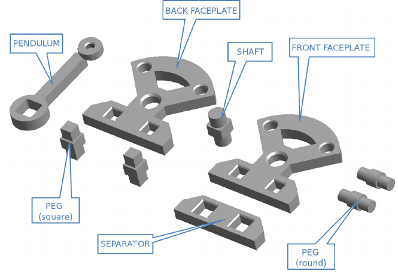

# A PDDL domain for the Cranfield assembly task 




## The Cranfield Benchmark

> The task-level programming system is an off-line programming system in which robot actions are specified only by their effects on objects. The resulting sequence of robot motions is generated automatically by the system. One of the realized applications of the system is the so-called Cranfield Assembly Benchmark which consists of 9 parts that can be assembled to form a mechanical pendulum (see [Figure](cranefield.png)). The task-planning process is performed in the following steps:
>
> At a workstation, supported by a comfortable graphic interface, a user interactively describes a work-cell. Normally, the work-cell components are standardized parts and therefore may be selected from a predefined library.
> Then, the user graphically specifies the assembly task to be performed and starts the planning system.
>
> The system automatically generates a sequence of robot actions/motions necessary to perform the task. It translates these robot instructions into executable robot commands specific for the robot type and passes them to the simulation system which visualizes the robot motions found for the specified assembly task. Therefore, the actual presence of the real robot or of the work-cell is not needed [1].
>
> [1] Hörmann, K., and U. Negretto. "Programming of the Cranfield assembly benchmark." Integration of Robots into CIM. Springer, Dordrecht, 1992. 263-283.


We develop a task planning domain in PDDL. We use `derived-predicates` in order to implement the ordering and assembly axioms (constraints).


## Supporting planners

Currently only *Fast-Downward (FD)* and *Fast-Forward (FF)* planners support this domain. 

**Note:** FD shows better performance in this domain.


## Running

run the command below in the main directory of safe-planner:

```bash
# in short (only a problem is given)
./sp benchmarks/multirob/cranfield/prob1.pddl -c fd ff

# or fully (both domain and problem files are given)
./sp benchmarks/multirob/cranfield/domain.pddl benchmarks/multirob/cranfield/prob1.pddl -c fd ff
```


pass the optional parameter `-d` to generate a graphical representation of the plan:

```bash
# the graphical representation of the output plan in dot
-- plan in dot file: benchmarks/multirob/cranfield/prob1.dot
```